# Manual Tecnico 

# Caratula

| Nombre | Carnet |
| ------------- | ------------- |
| Oscar Daniel Oliva España          | 201902663 |

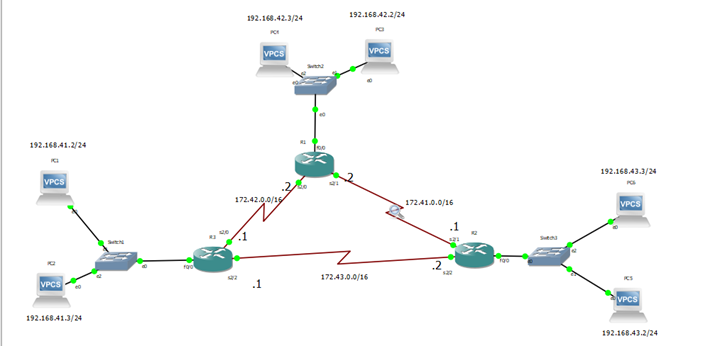
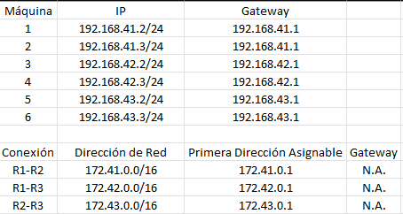

# Rutas estáticas
### R1
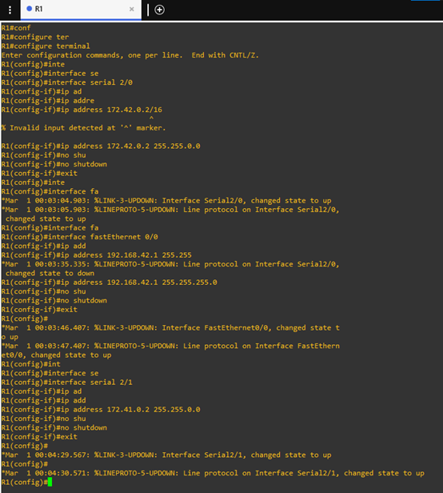
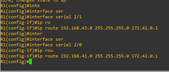
### R2
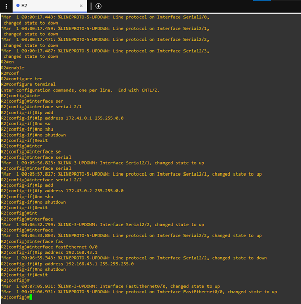
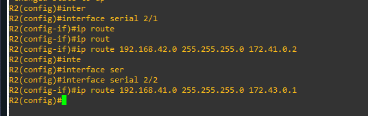

### R3
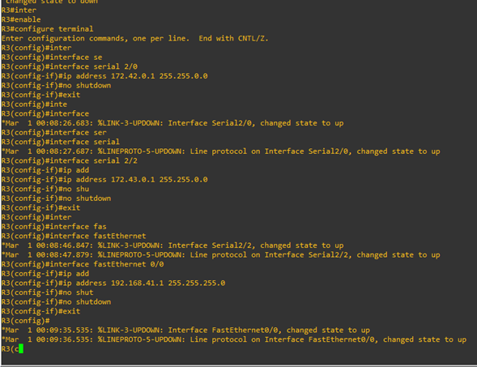
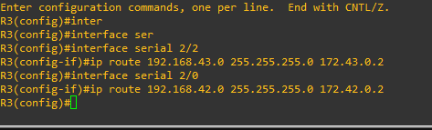

### PC1
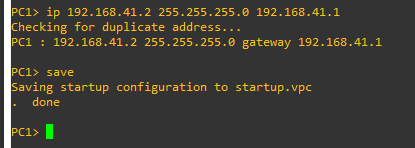
### PC2
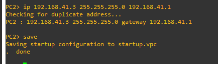
### PC3
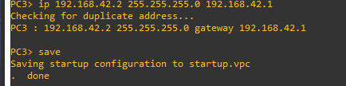
### PC4
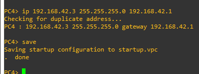
### PC5
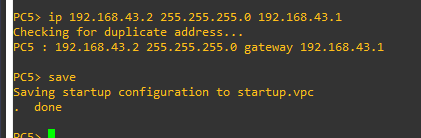
### PC6
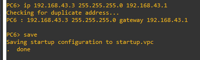

# Pings de Prueba
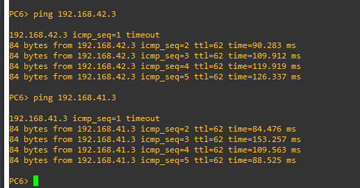

# Tablas de ruteo (show ip router)
### R1
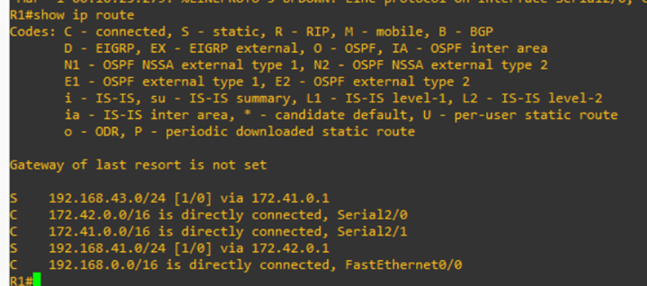
### R2
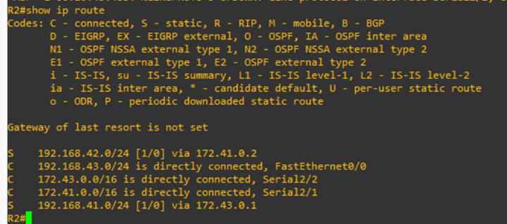

### R3
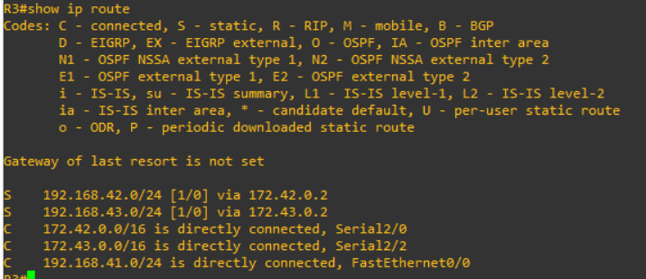

# Ping de prueba en WireShark

### Ping de referencia desde GNS (PC6 -> PC4):
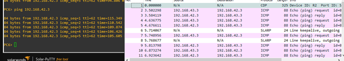
